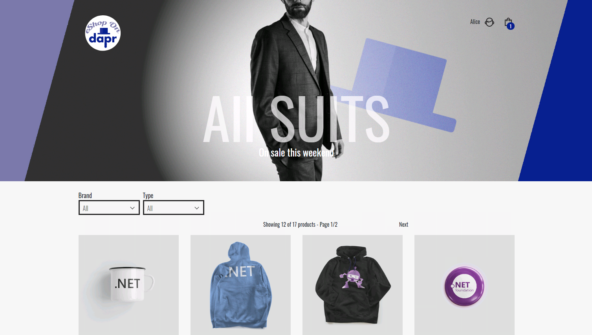
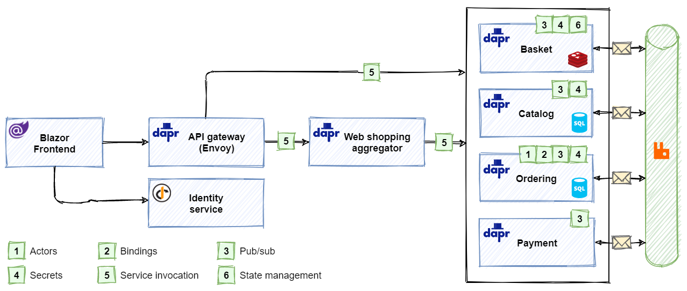

# eShop on Dapr

A sample .NET Core distributed application based on *[eShopOnContainers](https://github.com/dotnet-architecture/eShopOnContainers)*, powered by [Dapr](https://dapr.io/). The current version targets .NET 7.

The accompanying e-book **Dapr for .NET developers** uses the sample code in this repository to demonstrate Dapr features and benefits. You can [read the online version](https://docs.microsoft.com/dotnet/architecture/dapr-for-net-developers/) and [download the PDF](https://aka.ms/dapr-ebook) for free.

Dapr enables developers using any language or framework to easily write microservices. It addresses many of the challenges found that come along with distributed applications, such as:

- How can distributed services discover each other and communicate synchronously?
- How can they implement asynchronous messaging? 
- How can they maintain contextual information across a transaction?
- How can they become resilient to failure?
- How can they scale to meet fluctuating demand?
- How are they monitored and observed?

eShopOnDapr evolves (or, *Daprizes*, if you will) the earlier eShopOnContainers application by integrating Dapr building blocks and components: 

As focus of the eShopOnDapr reference application is on Dapr, the original application has been updated. The updated architecture consists of:

- A frontend web-app written in [Blazor](https://dotnet.microsoft.com/apps/aspnet/web-apps/blazor). It sends user requests to an API gateway microservice.

- The API gateway abstracts the backend core microservices from the frontend client. It's implemented using [Envoy](https://www.envoyproxy.io/), a high performant, open-source service proxy. Envoy routes  incoming requests to various backend microservices. Most requests are simple CRUD operations (for example, get the list of brands from the catalog) and handled by a direct call to a backend microservice.

- Other requests are logically more complex and require multiple microservices to work together. For these cases, eShopOnDapr implements an aggregator microservice that orchestrates a workflow across the microservices needed to complete the operation.

- The set of core backend microservices includes functionality required for an eCommerce store. Each is self-contained and independent of the others. Following widely accepted domain decomposing patterns, each microservice isolates a specific *business capability*:

  - The basket service manages the customer's shopping basket experience.
  - The catalog service manages product items available for sale.
  - The identity service manages authentication and identity.
  - The ordering service handles all aspects of placing and managing orders.
  - The payment service transacts the customer's payment.

- Finally, the event bus enables asynchronous publish/subscribe messaging across microservices. Developers can plug in any Dapr-supported message broker.

## Getting started

eShopOnDapr runs in containers and requires Docker to run. There are various ways to start the application:

- [Run eShopOnDapr from the CLI](docs/run-eshop.md#run-eshopondapr-from-the-cli)
- [Run eShopOnDapr from Visual Studio (best F5 debugging experience)](docs/run-eshop.md#run-eshopondapr-from-visual-studio)
- [Run eShopOnDapr from Visual Studio Code (allows you to debug individual containers))](docs/run-eshop.md#run-eshopondapr-from-visual-studio-code)
- [Run eShopOnDapr on a local Kubernetes cluster using Docker for Desktop](docs/run-eshop.md#run-eshopondapr-on-a-local-kubernetes-cluster-using-docker-for-desktop)
- [Run eShopOnDapr on an external Kubernetes cluster](docs/run-eshop.md#run-eshopondapr-on-an-external-kubernetes-cluster)
- [Run eShopOnDapr on Azure Container Apps](docs/run-eshop.md#run-eshopondapr-on-azure-container-apps)

Note that it will take a little while to start all containers. eShopOnDapr includes a health UI that you can use to see if the containers are ready. You can access it at http://localhost:5107.

When all microservices are healthy, you can navigate to http://localhost:5104 to view the eShopOnDapr UI.

### Attributions

Model photo by  [Angelo Pantazis](https://unsplash.com/@angelopantazis?utm_source=unsplash&utm_medium=referral&utm_content=creditCopyText)  on  [Unsplash](https://unsplash.com/?utm_source=unsplash&utm_medium=referral&utm_content=creditCopyText)
